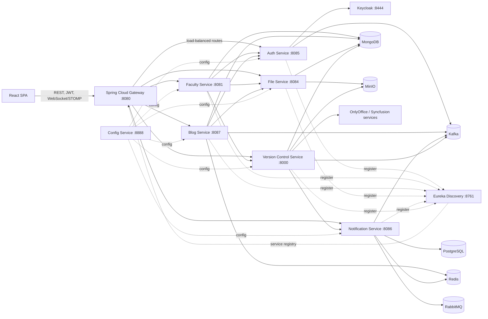

# Final Project Platform

An integrated academic collaboration platform for managing university records, final-year projects, blogs, notifications, files, and a custom version-control workspace. The repository in this folder contains the React frontend; the backend lives beside it at `../Back-End` and is implemented as a Spring Cloud microservice system.

## What This Application Does

The platform combines public discovery pages with authenticated role-based workspaces:

- Public website for published blogs, project results, documentation, and application downloads.
- Admin dashboard for users, roles, permissions, departments, students, teachers, employees, projects, groups, reports, settings, and moderation.
- Student and teacher workspace for repositories, milestones, tasks, pull requests, contributors, statistics, notifications, and profile management.
- Author workspace for writing, drafting, publishing, and managing blog stories.
- Notification inboxes for admin, author, student, teacher, staff, and dean flows.
- File management for profile images, logos, blog media, CLI releases, repository objects, and document previews.

## High-Level Architecture



## Frontend Architecture

The frontend is a Vite + React 19 single-page application.

- `src/App.jsx` defines the route tree and separates public routes from protected role workspaces.
- `src/AppRoot.jsx` wraps the app with authentication and optional Google OAuth providers.
- `src/auth/` owns session storage, token refresh coordination, role normalization, and route access rules.
- `src/services/RouteConfig.js` is the central contract for backend endpoints.
- `src/services/apiRoute.js` contains typed client helpers and payload normalization for faculty, blog, notification, user, and repository APIs.
- `src/services/axiosConfig.js` attaches access tokens and retries failed requests after coordinated refresh.
- `src/layout/` contains public and authenticated shells.
- `src/pages/` is organized by domain and role: `public`, `admin`, `student`, `teacher`, `staff`, `dean`, `author`, and `blog`.
- `src/components/` contains shared controls plus domain components for registration, blogs, repositories, pull requests, merge conflicts, notifications, and document viewing.

The app reads backend base URLs from Vite environment variables. In development, Vite proxies API traffic to the gateway:

- `/api/**`
- `/file/**`
- `/auth/**`
- `/repos/**`
- `/students/**`
- `/departments/**`
- `/batches/**`
- `/teachers/**`
- `/employees/**`

## Backend Architecture

The backend at `../Back-End` is a Java 17 Spring Cloud microservice architecture. Each business area is isolated behind its own service, and the gateway provides the single entry point for the frontend.

| Service | Port | Responsibility |
| --- | ---: | --- |
| `config-service` | `8888` | Centralized Spring Cloud Config server using native config files from `config-service/src/main/resources/config`. |
| `eurak-service` | `8761` | Eureka service discovery registry. |
| `gateway-service` | `8080` | Spring Cloud Gateway, CORS, Redis-backed rate limiting, retry policies, and service routing. |
| `auth-service` | `8085` | Login, signup, Google OAuth, refresh tokens, user management, roles, permissions, Keycloak integration, audit, and auth events. |
| `faculty-service` | `8081` | Academic domain: universities, faculties, departments, batches, academic years, semesters, students, teachers, employees, groups, and projects. |
| `file-service` | `8084` | Binary upload/download APIs for logos, profiles, blog files, and CLI application releases using MinIO metadata/storage. |
| `blog-service` | `8087` | Articles, drafts, publishing, comments, likes, shares, author profiles, media upload integration, and article events. |
| `notification-service` | `8086` | Notification persistence, email templates, WebSocket delivery, Kafka consumers, retry, rate limiting, and admin notification operations. |
| `version-control-service` | `8000` | Custom repository system: repositories, commits, tree browsing, file contents, pull requests, merge conflicts, milestones, tasks, invitations, contributors, stats, document extraction, blame, and MinIO object storage. |

## Gateway Routing

`gateway-service/src/main/java/com/final_project/gatewayservice/CustomRouteConfig.java` maps client paths to services:

| Gateway path | Target service |
| --- | --- |
| `/api/v1/auth/**`, `/api/v1/users/**`, `/api/v1/roles/**`, `/api/v1/permissions/**` | `auth-service` |
| `/api/v1/articles/**`, `/api/v1/files/**` | `blog-service` |
| `/api/v1/notifications/**` | `notification-service` |
| `/file/**` | `file-service` |
| `/auth/**`, `/repos/**`, `/api/v1/repos/**`, `/api/v1/milestone/**`, `/api/v1/task/**` | `version-control-service` |
| `/api/**` | `faculty-service` |

The frontend calls the gateway through `VITE_API_BASE_URL`. When that value is blank in local development, Vite uses relative URLs and proxies them to `VITE_DEV_PROXY_TARGET`, usually `http://localhost:8080`.

## Data and Infrastructure

The backend `docker-compose.yml` starts the platform dependencies:

- PostgreSQL for Keycloak and notification persistence.
- pgAdmin for PostgreSQL administration.
- Redis for gateway rate limiting, notification caching/rate limits, and blog caching.
- MinIO for object and file storage.
- Zookeeper and Kafka for async domain events.
- RabbitMQ for Spring Cloud Bus and AMQP-based configuration/event support.
- Keycloak for identity, realms, users, roles, and JWT issuing.
- OnlyOffice document server for document editing/preview flows.

MongoDB is referenced by several service configs (`faculty_db`, `blog_db`, `fileRecords`, `vic_application`) and must be available locally or through your environment.

## Authentication and Authorization

Authentication is centered on Keycloak and the `auth-service`.

1. The frontend posts login/signup/OAuth requests to `/api/v1/auth/**`.
2. `auth-service` validates credentials or OAuth tokens and communicates with Keycloak.
3. The frontend stores the access token through the auth storage layer and attaches `Authorization: Bearer <token>` to protected requests.
4. `axiosConfig.js` coordinates refresh-token calls so multiple `401` responses do not trigger duplicate refresh requests.
5. React routes use role facets from `src/auth/appRoles.js`: `admin`, `teacher`, `student`, and `author`.

Realm roles such as staff/dean are folded into application facets in the frontend role model, allowing shared layouts while keeping route authorization explicit.

## Main Domain Flows

### Academic Management

Admins manage core university data through the faculty service:

- Universities, faculties, departments, batches, academic years, and semesters.
- Students, teachers, employees, and their profile media.
- Final project registration, group membership, project completion, publishing, and public project results.

### Repository and Project Workspace

The version-control service implements a Git-like academic collaboration model:

- Repository creation and lookup by owner/access.
- Tree browsing, file contents, commit history, compare, diff, and blame.
- Pull requests with file diffs, merge operations, and conflict resolution.
- Milestones and task lifecycle: create, assign, submit, review, complete.
- Contributors, invitations, repository statistics, document extraction, and document blame.
- MinIO-backed compressed object storage for repository objects.

### Blog and Authoring

The blog service powers the public and author-facing writing features:

- Draft creation and story publishing.
- Public article feeds and story detail pages.
- Author story management.
- Comments, replies, likes, shares, views, and read-time metadata.
- File service integration for images and videos.

### Notifications

The notification service receives direct REST requests and Kafka domain events:

- User registration, password reset/change.
- Repository invitations and repository operations.
- Article operations, comments, and replies.
- Email rendering through Thymeleaf templates.
- In-app notification delivery and unread counters.
- WebSocket/STOMP support for live notification updates.

## Local Development

### Prerequisites

- Node.js and npm.
- Java 17.
- Maven wrapper support.
- Docker Desktop.
- MongoDB running locally, unless you change service configs.
- A configured Keycloak realm named by your backend environment variables.

### Start infrastructure

From the backend folder:

```bash
cd ../Back-End
docker compose up -d
```

Start MongoDB separately if it is not already running.

### Start backend services

Start services in this order so config and discovery are available first:

```bash
cd ../Back-End/config-service
./mvnw spring-boot:run

cd ../eurak-service
./mvnw spring-boot:run

cd ../gateway-service
./mvnw spring-boot:run
```

Then start the domain services you need:

```bash
cd ../auth-service && ./mvnw spring-boot:run
cd ../faculty-service && ./mvnw spring-boot:run
cd ../file-service && ./mvnw spring-boot:run
cd ../blog-service && ./mvnw spring-boot:run
cd ../notification-service && ./mvnw spring-boot:run
cd ../version-control-service && ./mvnw spring-boot:run
```

On Windows PowerShell, run the same commands with `.\mvnw.cmd spring-boot:run`.

### Start frontend

From this folder:

```bash
npm install
npm run dev
```

The frontend runs at `http://localhost:5173`.

## Frontend Environment Variables

Create or update `.env` in this folder:

```env
VITE_API_BASE_URL=
VITE_DEV_PROXY_TARGET=http://localhost:8080
VITE_API_WITH_CREDENTIALS=true
VITE_AUTH_COOKIE_REFRESH=false
VITE_GOOGLE_CLIENT_ID=
VITE_SYNCFUSION_DOC_EDITOR_SERVICE_URL=http://localhost:6002/api/documenteditor/
VITE_SYNCFUSION_LICENSE_KEY=
```

Use `VITE_API_BASE_URL=http://localhost:8080` when you want the browser to call the gateway directly. Keep it blank when you want Vite's dev proxy to handle gateway calls.

## Useful Commands

```bash
npm run dev          # Start Vite dev server
npm run build        # Build production assets
npm run preview      # Preview production build
npm run lint         # Run ESLint
npm run word:up      # Start Syncfusion document service compose file
npm run word:down    # Stop Syncfusion document service compose file
```

For backend services:

```bash
./mvnw test
./mvnw spring-boot:run
```

## Repository Layout

```text
FinalProject/
  Front-End/
    src/
      auth/          Session, tokens, role model, route gating
      api/           Axios client
      services/      API route contracts and service calls
      layout/        Public and authenticated layouts
      pages/         Role and domain pages
      components/    Shared UI and domain widgets
      hooks/         Data and interaction hooks
      context/       Theme, auth, language, sidebar, activity context
    vite.config.js   Dev proxy and build config
    package.json

  Back-End/
    config-service/
    eurak-service/
    gateway-service/
    auth-service/
    faculty-service/
    file-service/
    blog-service/
    notification-service/
    version-control-service/
    docker-compose.yml
```

## Architectural Notes

- The frontend deliberately centralizes URL construction in `RouteConfig.js` so backend route changes have one main update point.
- The gateway is the only intended frontend entry point for backend APIs.
- Service discovery uses Eureka and `lb://SERVICE-NAME` gateway routes.
- Config is externalized through Spring Cloud Config native files.
- JWT validation is repeated by resource services, keeping authorization enforcement close to each domain.
- Kafka carries cross-service events for notifications and activity-style workflows.
- Redis is used where low-latency rate limiting, idempotency, or caching matters.
- MinIO is shared by file and repository-object domains, but each service owns its own metadata and access rules.
- The version-control service is a domain service, not just storage. It owns repository semantics, access rules, pull request behavior, milestones, task workflow, and document-aware repository views.

## Documentation Entry Points

- API endpoint notes: `apiEndpoint.md`
- Notification design notes: `notification.md`
- Version-control notes: `version-control.md`
- CLI application notes: `cli-application.md`
- Backend notification notes: `../Back-End/notification.md`
- Backend version-control notes: `../Back-End/version-control-service/version-control.md`
